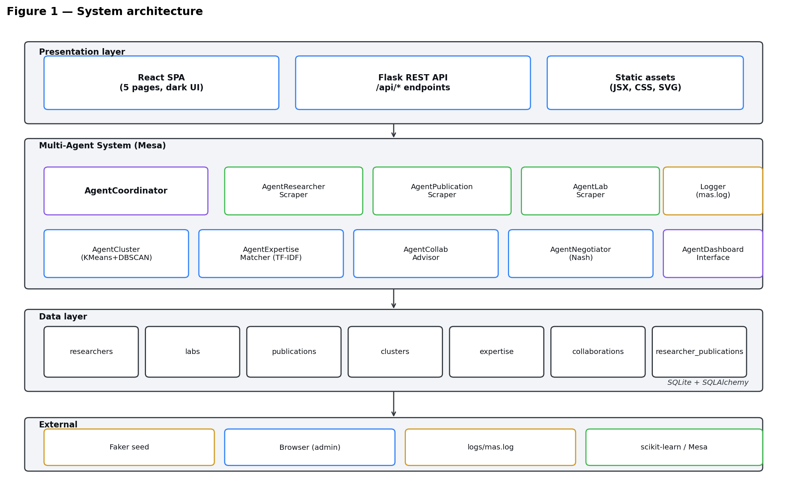
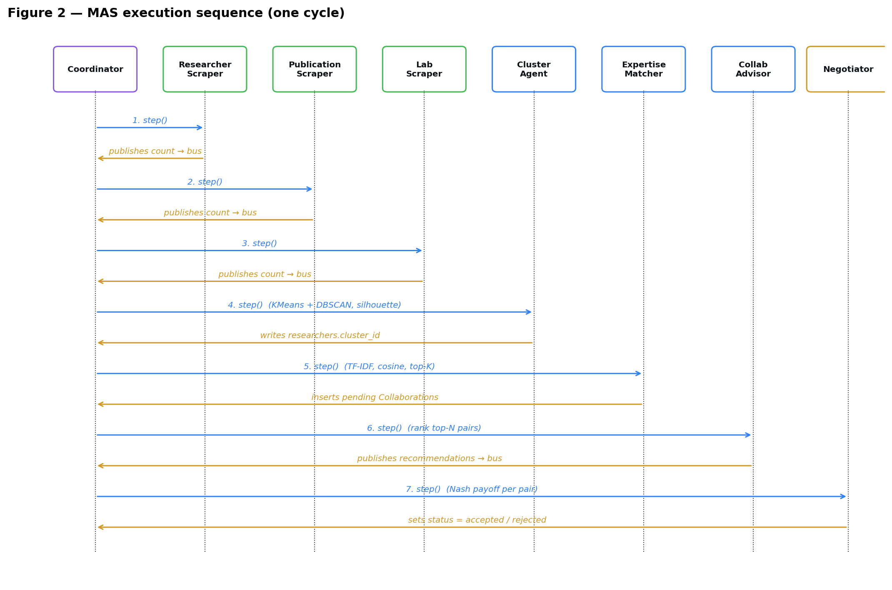
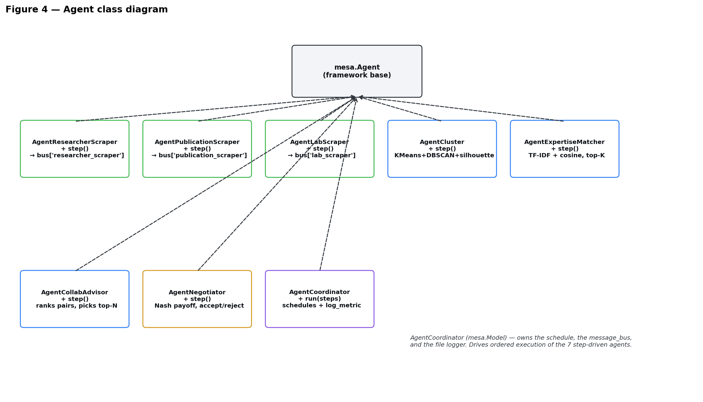
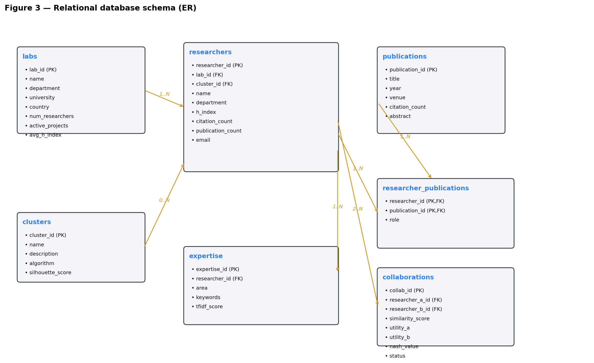

# Project HIDE — Intelligent University Observatory

> Research and Lab Management System using a Multi-Agent System
> *(DCAI semester project, 2025 – 2026)*

A seven-agent **Multi-Agent System** that monitors researchers, labs and
publications in a university, runs **AI clustering** on researcher feature
vectors, computes **TF-IDF expertise matching**, and resolves
collaboration recommendations through a **Nash-equilibrium negotiation**.
Everything is exposed through a dark, mission-control **Flask + React**
dashboard with five interactive pages.

---

## Table of contents

- [Screenshots](#screenshots)
- [Features](#features)
- [Architecture](#architecture)
- [Tech stack](#tech-stack)
- [Quick start](#quick-start)
- [Project layout](#project-layout)
- [The MAS pipeline](#the-mas-pipeline)
- [Database schema](#database-schema)
- [REST API](#rest-api)
- [Dashboard pages](#dashboard-pages)
- [Configuration](#configuration)
- [Development scripts](#development-scripts)
- [Spec compliance](#spec-compliance)
- [Roadmap](#roadmap)
- [Authors](#authors)
- [Acknowledgements](#acknowledgements)

---

## Screenshots

> Capture the five dashboard pages and drop the PNGs into `figures/` with
> the names below to make them appear here.

| Page | Preview |
|---|---|
| Overview | `figures/screenshot_overview.png` |
| Researchers | `figures/screenshot_researchers.png` |
| Clusters | `figures/screenshot_clusters.png` |
| Collaborations | `figures/screenshot_collabs.png` |
| Agents | `figures/screenshot_agents.png` |

System architecture (auto-generated):



---

## Features

- **Seven Mesa agents** orchestrated by an `AgentCoordinator` with strict
  observer → analysis → recommendation ordering.
- **AgentCluster** — KMeans (with silhouette-driven `k`) + DBSCAN, the
  higher-silhouette winner is persisted with the algorithm name.
- **AgentExpertiseMatcher** — TF-IDF over expertise + keywords, 200×200
  cosine similarity, top-K candidate generation.
- **AgentCollabAdvisor** — ranks the matcher's candidates and surfaces a
  curated top-N for human review.
- **AgentNegotiator** — bilateral 2×2 game-theoretic payoff matrix with
  Nash value, accept threshold and Pareto floor.
- **Flask REST API** with 16 endpoints (10 GET, 6 POST), incl. partial
  reruns for every analysis agent and a bulk-accept endpoint.
- **React dashboard** (no Node toolchain — served via standalone Babel)
  with five pages: Overview, Researchers, Clusters, Collaborations,
  Agents. Live log viewer, payoff matrix, force / arc network, KPI
  cards, sortable / paginated / searchable tables, CSV / log downloads,
  Alerts and Settings modals, themable density.
- **Reproducible offline seed** — Faker-driven `seed.py` builds 200
  researchers, 20 labs, 500 publications in a few seconds.
- **One-click reset** — *Agents → Reset + reseed DB* in the dashboard.

---

## Architecture

The system has four layers (presentation, MAS, data, external). The MAS
agents communicate through a shared in-memory `message_bus` keyed by
agent name, which keeps them loosely coupled and makes partial reruns
safe.


Sequence of one full cycle:



Agent class hierarchy:



---

## Tech stack

| Layer | Tools |
|---|---|
| MAS framework | [Mesa](https://github.com/projectmesa/mesa) |
| AI / ML | scikit-learn (KMeans, DBSCAN, TF-IDF, cosine similarity), NumPy |
| Game theory | Custom 2×2 payoff matrix + Nash value |
| Database | SQLite via SQLAlchemy 2.x |
| Web backend | Flask + Flask-CORS |
| Web frontend | React 18 (UMD), in-browser Babel — no Node required |
| Charts | Hand-rolled SVG (no Plotly / no D3) |
| Seed data | Faker |
| Diagrams | matplotlib (regenerable) |
| Docs | Markdown + python-docx exporter |

---

## Quick start

> Tested with **Python 3.11+** on Windows (PowerShell), macOS, Linux.

```powershell
# 1. clone
git clone <this-repo>.git
cd DCAI-Project

# 2. create / activate venv
python -m venv .venv
.venv\Scripts\Activate.ps1                # Windows PowerShell
# source .venv/bin/activate                # macOS / Linux

# 3. install runtime deps
pip install -r requirements.txt           # see Configuration if missing

# 4. one-time: seed the SQLite DB (200 researchers, 20 labs, 500 pubs)
python -m observatory.db.seed

# 5. (optional) run a full MAS cycle from the CLI
python -m observatory.main

# 6. start the dashboard at http://localhost:5000
python -m observatory.web.api
```

Then in the browser:

1. Click **Run MAS Cycle** in the sidebar to populate clusters / collabs.
2. Browse Overview → Researchers → Clusters → Collaborations → Agents.
3. The Agents page shows live log lines parsed from `logs/mas.log`.

> The dashboard hot-reloads JSX automatically on a hard refresh — no
> build step needed.

---

## Project layout

```
DCAI-Project/
├── observatory/                  ← main Python package
│   ├── agents/
│   │   ├── coordinator.py        ← AgentCoordinator (mesa.Model)
│   │   └── observer/
│   │       ├── researcher_scraper.py
│   │       ├── publication_scraper.py
│   │       └── lab_scraper.py
│   ├── analysis/
│   │   ├── agent_cluster.py
│   │   ├── agent_expertise.py
│   │   └── feature_engineering.py
│   ├── recommendation/
│   │   ├── agent_collab_advisor.py
│   │   └── agent_negotiator.py
│   ├── db/
│   │   ├── models.py             ← SQLAlchemy schema (7 tables)
│   │   ├── database.py
│   │   ├── seed.py               ← Faker seed
│   │   └── project_hide.db       ← (gitignored)
│   ├── web/
│   │   ├── api.py                ← Flask app + REST endpoints
│   │   └── static/               ← React SPA
│   │       ├── index.html
│   │       ├── app.jsx
│   │       ├── components.jsx
│   │       ├── pages.jsx
│   │       ├── data.jsx
│   │       └── tweaks-panel.jsx
│   ├── config.py
│   └── main.py                   ← `python -m observatory.main`
├── logs/
│   └── mas.log                   ← written by the coordinator
├── figures/                      ← UML diagrams (regenerable)
├── scripts/
│   ├── make_figures.py           ← regenerates UML PNGs
│   └── md_to_docx.py             ← Markdown → .docx converter
├── REPORT.md / REPORT.docx              ← internal implementation log
├── SUBMISSION_REPORT.md / .docx         ← formal submission report
├── SLIDES_PROMPT.md                     ← Canva/Claude-Design prompt
├── PROJECT_HIDE_UI_BRIEF.md             ← original UI brief
├── Project_HIDE3.pdf                    ← official spec
└── README.md                            ← this file
```

---

## The MAS pipeline

`AgentCoordinator.run(steps=1)` executes the seven step-driven agents in
strict order:

1. **AgentResearcherScraper** → publishes `count` to `bus["researcher_scraper"]`.
2. **AgentPublicationScraper** → publishes `count`.
3. **AgentLabScraper** → publishes `count`.
4. **AgentCluster** → KMeans + DBSCAN, picks the higher silhouette,
   writes `researchers.cluster_id`, inserts rows into `clusters`.
5. **AgentExpertiseMatcher** → TF-IDF + cosine, top-5 per researcher,
   inserts pending rows into `collaborations`, exposes `top_matches`.
6. **AgentCollabAdvisor** → ranks the candidates, picks top-20,
   publishes `recommendations`.
7. **AgentNegotiator** → 2×2 payoff matrix per pair, computes Nash
   value, sets `collaborations.status` to *accepted* or *rejected*.

Every step writes one structured line to `logs/mas.log`, which the
dashboard's Agents page parses for the live log viewer and the per-agent
sparkline.

```
[2026-05-05 01:19:14] AgentCoordinator: cycle begin
[2026-05-05 01:19:14] AgentResearcherScraper: 200 researchers loaded
[2026-05-05 01:19:14] AgentCluster: 8 clusters, silhouette=0.10 (algo=kmeans)
[2026-05-05 01:19:14] AgentExpertiseMatcher: 218 pairs inserted, avg_sim=0.63
[2026-05-05 01:19:14] AgentCollabAdvisor: 20 recommended, avg_sim=0.66
[2026-05-05 01:19:14] AgentNegotiator: 218 accepted / 0 rejected, nash=0.24
```

---

## Database schema

Seven tables, all with foreign keys, indexes on `researchers.lab_id` and
`researchers.cluster_id`, and cascading deletes.



| Table | Purpose |
|---|---|
| `labs` | Laboratory records (university, country, headcount, avg h-index) |
| `researchers` | Researchers with `lab_id` and `cluster_id` foreign keys |
| `clusters` | Cluster definitions with `algorithm` and `silhouette_score` |
| `publications` | Publications (year, venue, citations, abstract) |
| `researcher_publications` | M:N join with a `role` column (*first* / *co-author* / *senior*) |
| `expertise` | One row per (researcher × area) with keywords + `tfidf_score` |
| `collaborations` | Pair output: `similarity_score`, `utility_a`, `utility_b`, `nash_value`, `status` |

---

## REST API

Base URL: `http://localhost:5000/api`.

| Method | Path | Purpose |
|---|---|---|
| GET | `/api/overview` | KPIs + pubs/year + top-10 labs + recent publications |
| GET | `/api/researchers` | Filterable researcher list (`lab`, `cluster`, `expertise`, `min_h`) |
| GET | `/api/clusters` | Clusters with `top_areas` |
| GET | `/api/expertise` | Distinct expertise areas |
| GET | `/api/labs` | Distinct lab names |
| GET | `/api/collaborations` | Top-150 collaborations (mini researcher payloads) |
| GET | `/api/agents` | Per-agent status + 12-bin sparkline (parsed from `mas.log`) |
| GET | `/api/logs?n=` | Last *n* parsed log lines |
| GET | `/api/researchers/export.csv` | Researcher CSV export |
| GET | `/api/logs/download` | Plain-text `mas.log` download |
| POST | `/api/run` | Full MAS cycle |
| POST | `/api/recluster` | `AgentCluster` only |
| POST | `/api/recommendations` | `AgentExpertiseMatcher` + `AgentCollabAdvisor` + `AgentNegotiator` |
| POST | `/api/advisor` | `AgentExpertiseMatcher` + `AgentCollabAdvisor` only |
| POST | `/api/collaborations/accept_pending` | Bulk-accept pending |
| POST | `/api/reseed` | `reset_db()` + `seed_all()` |

Example:

```bash
curl http://localhost:5000/api/overview | jq .
curl -X POST http://localhost:5000/api/run | jq .
```

---

## Dashboard pages

1. **Overview** — five KPI cards (researchers, labs, publications, avg
   h-index, active clusters), publications-per-year bar chart, top-10
   labs horizontal bars, recent-publications table.
2. **Researchers** — lab/cluster/expertise/min-h filters, live
   name-search, paginated table (real prev/next + numbered pages),
   h-index × citations scatter coloured by cluster, sticky profile panel
   with TF-IDF expertise bars and collaboration recommendations. CSV
   export wired.
3. **Clusters** — silhouette-tagged summary cards (real `top_areas` from
   the API), 2D scatter projection coloured by cluster, comparison table
   sortable by silhouette, expertise heatmap. *Re-cluster* button.
4. **Collaborations** — four KPI cards, force/arc network of top-50
   pairs, 2×2 payoff matrix viewer with pair selector, sortable table
   with All/Accepted/Pending/Rejected filter. *Re-evaluate* and *Accept
   all pending* buttons.
5. **Agents** — eight status cards driven by `mas.log`, live log
   viewer with auto-tail, *Run full MAS cycle / Re-run clustering /
   Re-run recs / Reset + reseed DB / Download log* buttons.

Sidebar: **Run MAS Cycle**, an *Alerts* modal listing errored / idle
agents, and a *Settings* modal exposing density, network layout, log
toggle and data actions.

---

## Configuration

Edit `observatory/config.py` for paths.

`requirements.txt` (suggested minimum):

```text
mesa>=2.1
flask>=3.0
flask-cors
sqlalchemy>=2.0
scikit-learn>=1.3
numpy
faker
python-docx          # only for scripts/md_to_docx.py
matplotlib           # only for scripts/make_figures.py
```

The dashboard pulls React 18 and Babel-standalone from a CDN inside
`observatory/web/static/index.html`, so **no Node toolchain is needed**.

---

## Development scripts

```powershell
# Regenerate the four UML PNGs in figures/
python scripts/make_figures.py

# Convert any Markdown report to .docx (figures embedded automatically)
python scripts/md_to_docx.py SUBMISSION_REPORT.md
python scripts/md_to_docx.py REPORT.md
```

The Markdown → .docx converter understands ATX headings, GitHub tables,
fenced code blocks, ordered / unordered lists, inline `**bold**` /
`*italic*` / `` `code` `` and a custom `<!-- FIG: figures/foo.png |
Caption -->` marker that embeds an image with a centred italic caption.

---

## Spec compliance

Compared to the official specification (`Project_HIDE3.pdf`):

| Section of the spec | Status |
|---|---|
| §1 — six high-level requirements | ✅ 6 / 6 |
| §2 — five mandatory learning objectives (LLM is optional) | ✅ 5 / 5 |
| §3 — nine named agents | ✅ 7 / 9 (Coordinator + 3 observers + Cluster + ExpertiseMatcher + CollabAdvisor + Negotiator). Dashboard implemented as a Flask+React layer rather than a Mesa step-driven agent. LLM agent skipped (optional). |
| §4 — five-table relational schema | ✅ Implemented as a 7-table superset with FKs and indexes |
| §5 — Python tools (Mesa, sklearn, Flask, SQLite) | ✅ All used |
| §6 — five expected deliverables | ✅ 5 / 5 (slides delivered separately) |
| §8 — six evaluation criteria | ✅ All addressable |

Full discussion in `SUBMISSION_REPORT.md` §11.

---

## Roadmap

- [ ] Live web scraping in observer agents (replace the read-from-DB
      bodies with `requests` + `BeautifulSoup` against Google Scholar /
      DBLP / lab pages).
- [ ] Wrap the dashboard refresh as a Mesa `AgentDashboardInterface.step()`
      to fully match the spec's vocabulary.
- [ ] Optional LLM extension — embed publication abstracts with
      `sentence-transformers` and re-rank the matcher's pairs.
- [ ] Persist a history of cycles so the Overview KPI deltas reflect a
      real change against the previous run.
- [ ] Enrich the cluster feature vector with the TF-IDF embedding of the
      expertise field.

---

## Authors

| Name | Role | Contact |
|---|---|---|
| *(team member 1)* | *(role)* | *(email)* |
| *(team member 2)* | *(role)* | *(email)* |
| *(team member 3)* | *(role)* | *(email)* |

> Replace the placeholders above before publishing the repo.

---

## Acknowledgements

Project HIDE was proposed and supervised by **Mme Wided Guezguez**
(`widedguezguez@gmail.com`) as part of the DCAI 2025 – 2026 semester
project. The official specification is `Project_HIDE3.pdf` (6 April
2026).

---

## License

Academic / educational use. *(Add a `LICENSE` file — MIT recommended —
before making the repo public.)*
